# 🚀 Project Title: Landslide-Monitoring-System

## 📌 Overview
Landslide Monitoring System with Client and Control Center to Monitor Landslides, Predict Events, and Coordinate Rescue Operations.
## 🧠 Key Features
- ✅ Real-time tracking , smart control
- ✅ Web App Integration / IoT Support
- ✅ Admin Dashboard / Analytics Dash
- ✅ User Friendly 

## 🛠️ Technologies Used

### 💻 Frontend


### 🧩 Backend


### ⚙️ Hardware


## 🧩 Available Platforms
- 🌐 Web
- 🚀 Embedded (ESP32)

## ⚙️ System Architecture
> _The system consists of multiple clients (users) and a central control node.
Each client node is equipped with sensors such as IMUs and other modules, which collect real-time data. All client nodes are interconnected and continuously transmit their data to the central control node.The control node aggregates and analyzes this data to determine whether a landslide event has occurred or is likely to occur, using predictive algorithms based on sensor readings and threshold analysis._

```mermaid
graph TD
  subgraph User Interface
    User["👤 User"]
    UI["🖥️ Next.js Frontend"]
  end

  subgraph ESP32 Hardware
    ESP32["🧠 ESP32 Controller"]
    MPU["📈 MPU6050 (I2C)\nSDA: GPIO 21\nSCL: GPIO 22"]
    GPS["📡 Neo-6M GPS (UART)\nRX: GPIO 16\nTX: GPIO 17"]
    LoRa["📶 LoRa Module (SPI)\nSCK: GPIO 5\nMISO: GPIO 19\nMOSI: GPIO 27\nCS: GPIO 18\nRESET: GPIO 14\nDIO0: GPIO 26"]
  end

  User -->|"UI Input"| UI
  UI -->|"Lora"| ESP32
  ESP32 -->|"Sensor Data"| UI

  ESP32 --> MPU
  ESP32 --> GPS
  ESP32 --> LoRa

```


## 📸 Screenshots / Demo

| Dashboard |
|-----------|
| 


## 📱 Installation & Setup

### Prerequisites
- [ ] Node.js 
- [ ] ESP32
- [ ] Visual Studio Code

### Setup Steps
```bash
# Clone the repository
git clone https://github.com/Raghavan2005/Landslide-Monitoring-System.git
cd Landslide-Monitoring-System

# Install dependencies - Frontend
cd Frontend
npm install         # For Node.js backend
npm run dev         # To Run the Project

# Install dependencies - Backend
cd Backend
npm install         # For Node.js backend
npm start           # To Run the Project

```


## 📄 License
This project is licensed under the [MIT License](LICENSE).

